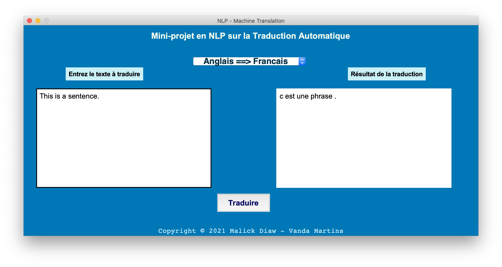
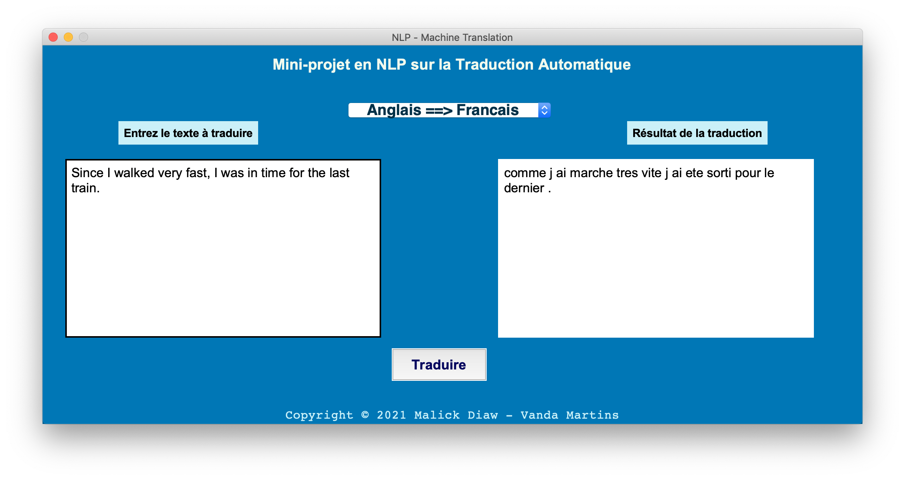

# Natural Language Processing and Application
#### Université Mohamed V, Faculté des Sciences de Rabat 
## Machine Translation Mini-Project

<u>Made by:</u> 	             <a href="https://github.com/MalickDiaw/"> Malick Diaw</a>   -  <a href="https://github.com/Vanda-Barbosa/Depot-Mini_Projet-NPL">Vanda Martins Barbosa</a>

<u>Supervised by:</u> 	    <a href="https://github.com/AbdelMahm">Pr. Abdelhak Mahmoudi</a>

This is a summary illustrating our **Natural Language Processing (NLP) module** project, semester 2 of the **Master of Data Engineering and Software Development (IDDLo)** on the realization of a **Machine Translation** .

This project aims to translate a text from a source language into another text from a destination language.

In this project, we made two translation models, one for a translation from French to Portuguese and the other from English to French.

These two models are illustrated and explained in detail step by step in a **jupyter NoteBook** for each one, [notebook english french](https://github.com/MalickDiaw/Depot-Mini-projet-NLP/blob/main/machine_translation/mini_projet/nlp_machine_translation_eng_fr.ipynb) - [notebook french portuguese](https://github.com/MalickDiaw/Depot-Mini-projet-NLP/blob/main/machine_translation/mini_projet/nlp_machine_translation_fr_por.ipynb).

For its realization, we built a **deep neural network using the Transformer** mechanism "*Attention is all you need*" to create a Machine Translation model.

#### The different fundamental steps are:
<ul>
    <li>Loading the libraries and the dataset for training </li>
    <li>Pre-processing: cleaning and tokenization </li>
    <li>The creation of Classes and Functions to build a Transformer model </li>
    <li>Building and training the model </li>
    <li>And finally the prediction to visualize the results. </li>
</ul>

#### Here are some screenshots of the application:

######
######
######

# Natural Language Processing and Application
#### Université Mohamed V, Faculté des Sciences de Rabat 
## Machine Translation Mini-Project

<u>Réalisé par :</u> 	        <a href="https://github.com/MalickDiaw/"> Malick Diaw</a>   -  <a href="https://github.com/Vanda-Barbosa/Depot-Mini_Projet-NPL">Vanda Martins Barbosa</a>

<u>Supervisé par :</u> 	     <a href="https://github.com/AbdelMahm">Pr. Abdelhak Mahmoudi</a>

Ceci est un résumé illustrant notre **projet du module Natural Language Processing (NLP)**, semestre 2 du **Master Ingénierie de Données et Développement Logiciel (IDDLo)** portant sur la réalisation d’une **Traduction Automatique (Machine Translation)**.

Ce projet fait objet de traduire un texte d’un langage source en un autre texte d’un langage de destination.

Dans ce projet, on a réalisé deux modèles de traduction, l’un pour une traduction de Français en Portugais et l’autre de l’anglais en Français.

Ces deux modèles sont illustrés et expliqués en détail étapes par étapes dans un **jupyter NoteBook** pour chacun, [notebook english french](https://github.com/MalickDiaw/Depot-Mini-projet-NLP/blob/main/machine_translation/mini_projet/nlp_machine_translation_eng_fr.ipynb) - [notebook french portuguese](https://github.com/MalickDiaw/Depot-Mini-projet-NLP/blob/main/machine_translation/mini_projet/nlp_machine_translation_fr_por.ipynb).

Pour sa réalisation, nous avons construit un **réseau de neurones profonds en utilisant le mécanisme de Transformer** « *Attention is all you need* » pour former un modèle de Machine Translation.

#### Les différentes étapes fondamentales sont :
<ul>
    <li>Le chargement des librairies et du dataset pour l’entrainement</li>
    <li>Le pre-processing: nettoyage et tokenization</li>
    <li>La création des Classes et Fonctions pour construire un modèle de Transformer</li>
    <li>La construction et l’entrainement du modèle</li>
    <li>Et enfin la prédiction pour visualiser les résultats.</li>
</ul>

#### Voici quelques captures de l'application :

